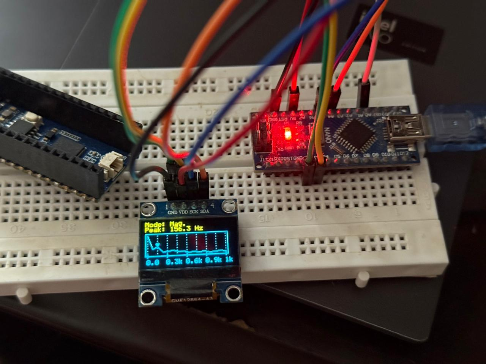

# Spectogaph Nano

## Description

A simplified frequency spectrum visualizer in real-time with the Arduino Nano.

## How to compile

This program was entirely developed on _vscode_ through the `PlatformIO` extension.

## Pinout

The circuit and its components are connected in the following way:

| ATmega328P pin | Arduino Nano pin | Component | Description |
|:--------------:|:-----------------:|:--------:|:------------|
| PC0 | A0 | Signal input | Positive signal input for the ADC. |
| PD2 | D2 | Button | Changes the spectrum plotting from linear to logarithmic. |
| PD3 | D3 | Button | Applies a [Hamming Window](https://en.wikipedia.org/wiki/Window_function#Hamming_window) to the signal. |
| - | GND | Display | Ground pin for the SSD1306 display. |
| - | 5V | Display | Input voltage (VDD) for the SSD1306 display. |
| PC5 | A5 | Display | SCL pin for the SSD1306 display. |
| PC4 | A4 | Display | SDA pin for the SSD1306 display. |

**NOTE**: The buttons are active-high and need external pull-down resistors. A debouncing capacitor should also be used on each button.

**NOTE**: The on-chip ATmega328P ADC is used directly for the measurement of the signal and  is configured for 5V, so the input signal MUST be $0 \le x \le 5V$.

An assembly example of the project. Note that the buttons are not used in this example, their equivalent pins on the board instead being connected directly to 5V (`D2`) and GND (`D3`). The example signal used is a _100 Hz, 50% duty-cycle_ PWM signal from a Raspberry Pi Pico 2. Because our current frequency resolution is about 78 Hz, we can't measure the exact peak at 100 Hz. Also note that the software has been designed to not consider 0 Hz a valid peak frequency, given that our input signal will always have a non-zero, large DC component.

## How to configure the firmware

In `src/main.c` you can edit some fundamental defines, although after many tests, those were the best values I came up with, being a not-really-good-but-good-enough mix between acquiring enough signal information for displaying and not having the micro crashing or freezing.

| Define name | Description |
|:-----------:|:------------|
| `NO_OF_SAMPLES` | The number of samples captured by the ADC for analysis per cycle. |
| `SAMPLING_FREQUENCY` | The sampling frequency. Per _Nyquist's sampling theorem_, for the current value of 2.5 kHz, we can measure, in theory, signal components up to 1.25 kHz. |
| `ADC_DELAY_US` | The time delay between each ADC measurement. Its value is highly linked to the ADC configuration, its default properties and the _sampling frequency_ above, so only thinker with it if you really know what you are doing. |
| `FREQUENCY_RESOLUTION` | The frequency delta between each FFT bin. It must always be given by the formula (`SAMPLING_FREQUENCY` / `NO_OF_SAMPLES`) (i.e., _78.125 Hz_ for our currently values). |
| `WINDOW_ALPHA` | The alpha parameter of the [Hamming Window](https://en.wikipedia.org/wiki/Window_function#Hamming_window). |
| `BUFFER_SIZE` | Used for the drawing text to the display. |

## Credits

* Matiasus: [SDD1306 - C Library for SSD1306 0.96" OLED display](https://github.com/Matiasus/SSD1306).
